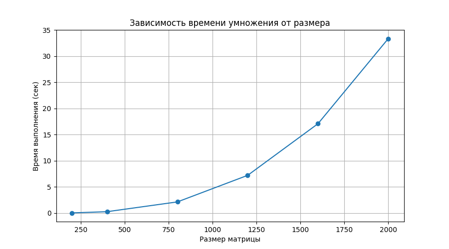

#  Лабораторная работа №1

**Выполнил:** Явкин Никита Олегович
**Группа:** 6213  

##  Цель работы
Реализовать программу на C++ для умножения квадратных матриц, автоматизировать запуск серии экспериментов с различными размерами, измерить время выполнения, сохранить результаты в CSV и визуализировать зависимость времени от размера матрицы.

## Описание реализации

### C++ модуль (`matrix_multi.cpp`)
- **Алгоритм:** классическое умножение с оптимизированным порядком циклов **(i → k → j)** для улучшения локальности кэша
- **Хранение данных:** `std::vector<std::vector<double>>`
- **Ввод/вывод:** чтение из текстовых файлов (первая строка — размер `n`, далее элементы построчно), запись результата в файл
- **Замер времени:** `std::chrono::high_resolution_clock` с выводом в stdout
- **Обработка ошибок:** проверка открытия файлов, сверка размеров матриц

### Python скрипт (`verif.py`)
Автоматизация бенчмарка и визуализация:
- Генерация пар случайных матриц для заданных размеров
- Запуск скомпилированного бинарника `./lab1` через `subprocess`
- Парсинг времени выполнения из stdout (regex)
- Сохранение результатов в `results.csv`
- Построение графика `plot.png` с помощью `matplotlib`

---

## Методика экспериментов

**Размеры матриц:** `200, 400, 800, 1200, 1600, 2000`

**Параметры генерации:**
- Тип: квадратные матрицы `n × n`
- Диапазон элементов: `[-5, 5]` (равномерное распределение)
- Формат файлов: первая строка содержит размер, далее `n` строк с элементами
- Имена файлов: `A-{size}.txt`, `B-{size}.txt`, `C-{size}.txt`

## Результаты экспериментов

### Таблица времени выполнения

| Размер матрицы (n) | Время (сек) |
|:------------------:|:-----------:|
| 200                | 0.034111    |
| 400                | 0.266468    |
| 800                | 2.134880    |
| 1200               | 7.216800    |
| 1600               | 17.089100   |
| 2000               | 33.363700   |

### График зависимости времени от размера

> **Вывод:** На больших размерах производительность определяется не только алгоритмической сложностью, но и архитектурой памяти.

## Выводы
1. Реализована корректная программа умножения матриц на C++ с оптимизацией порядка циклов.
2. Написан Python-скрипт для автоматизации серии экспериментов, парсинга результатов и визуализации.
3. Экспериментально подтверждена кубическая зависимость времени от размера на малых `n`.
4. Выявлено значительное отклонение от теоретической модели при `n ≥ 1600`, обусловленное ограничениями кэш-памяти процессора.
5. Результаты успешно экспортированы в `results.csv` и визуализированы в `plot.png`.

## Инструкция по запуску

### Требования
- Компилятор: `g++` (поддержка C++17)
- Python 3.8+ с библиотеками: `numpy`, `matplotlib`

### 1️ Компиляция C++ программы
g++ -Wall -Wconversion -Wextra -Wpedantic -std=c++11 -o lab1 matrix_multi.cpp
./lab1
python3 verif.py