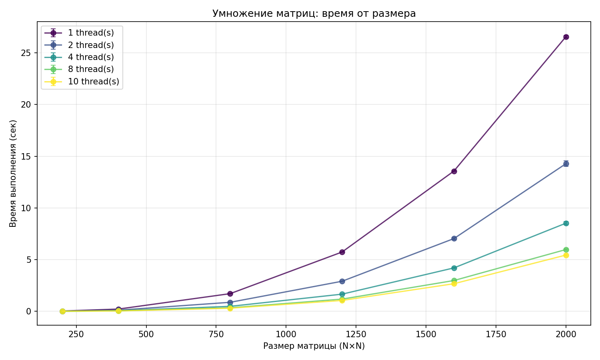
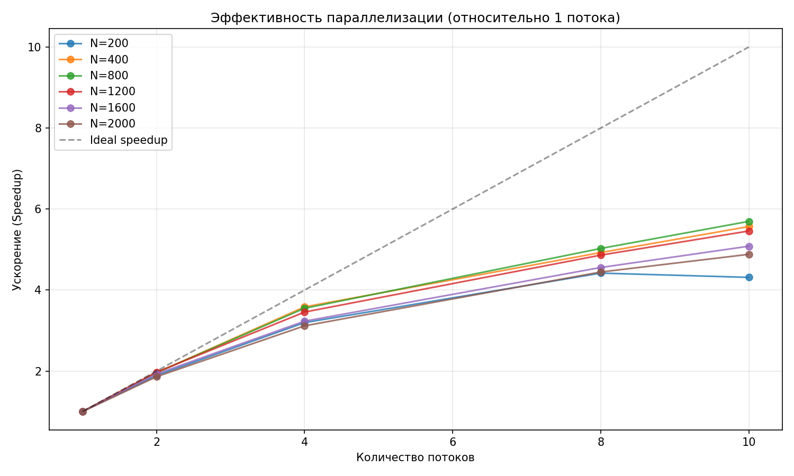

#  Лабораторная работа №2

**Выполнил:** Явкин Никита Олегович
**Группа:** 6213  

##  Цель работы
Реализовать программу на C++ для умножения квадратных матриц с использованием технологии OpenMP, автоматизировать запуск серии экспериментов с различными размерами матриц и количеством потоков, измерить время выполнения, рассчитать производительность (GFLOPS) и ускорение (speedup), сохранить результаты в CSV и визуализировать зависимости.

## Описание реализации

### C++ модуль (`matrix_multi.cpp`)
- **Алгоритм:** классическое умножение с оптимизированным порядком циклов **(i → k → j)** для улучшения локальности кэша
- **Параллелизация:** Директива #pragma omp parallel for collapse(2) с schedule(dynamic) для балансировки нагрузки
- **Хранение данных:** `std::vector<std::vector<double>>`
- **Ввод/вывод:** чтение из текстовых файлов (первая строка — размер `n`, далее элементы построчно), запись результата в файл
- **Замер времени:** `std::chrono::high_resolution_clock` с выводом времени и расчётом GFLOPS
- **Обработка ошибок:** Проверка открытия файлов, сверка размеров матриц, обработка аргументов

### Python скрипт (`verif.py`)
Автоматизация бенчмарка и визуализация:
- Генерация пар случайных матриц с фиксированным seed для воспроизводимости
- Запуск бинарника ./lab1 через subprocess с разными параметрами
- Парсинг времени выполнения и GFLOPS из stdout (regex)
- Сохранение результатов в `results.csv`
- Построение двух графиков: `plot_time.png` (время от размера для разных количеств потоков) и `plot_speedup.png` (ускорение относительно 1 потока с линией идеального масштабирования)

## Методика экспериментов

**Размеры матриц:** `200, 400, 800, 1200, 1600, 2000`

**Параметры генерации:**
- Тип: квадратные матрицы `n × n`
- Количество потоков: 1, 2, 4, 6, 8, 10 (10 максимум для процессора Apple M4)
- Повторов на конфигурацию: 3
- Диапазон элементов: `[-5, 5]` (равномерное распределение)
- Формат файлов: Первая строка: n, далее n строк с элементами
- Имена файлов: `A-{size}.txt`, `B-{size}.txt`, `C-{size}.txt`

## Результаты экспериментов

### Таблица времени выполнения

| Size|   1 thr  |   2 thr  |   4 thr  |   8 thr  |   10 thr  |
|------|:--------:|:--------:|:--------:|:--------:|:--------:|
|  200 |   0.0272 |   0.0144 |   0.0085 |   0.0061 |   0.0063 |
|  400 |   0.2156 |   0.1101 |   0.0602 |   0.0438 |   0.0387 |
|  800 |   1.7080 |   0.8709 |   0.4810 |   0.3398 |   0.2999 |
| 1200 |   5.7344 |   2.9074 |   1.6589 |   1.1795 |   1.0506 |
| 1600 |  13.5674 |   7.0351 |   4.1988 |   2.9777 |   2.6694 |
| 2000 |  26.5510 |  14.2712 |   8.5192 |   5.9730 |   5.4387 |

### График зависимости времени от размера

## Анализ результатов
1) Зависимость времени от размера

- На малых размерах (n ≤ 800) наблюдается близкая к теоретической кубическая зависимость O(n³)
- При n ≥ 1600 рост времени замедляется из-за ограничений пропускной способности памяти и кэш-промахов (матрица 2000×2000 × 8 байт ≈ 32 МБ не помещается в L3-кэш)

2) Эффективность параллелизации

- До 4 потоков: почти линейное ускорение (~1.8–1.9× на каждый удвоение потоков)
- После 4 потоков: прирост замедляется из-за архитектуры Apple M4: 4 мощных ядра (performance-cores); 6 энергоэффективных ядер (efficiency-cores); После заполнения быстрых ядер добавление медленных даёт меньший прирост

3) Насыщение производительности

- Максимальное ускорение: ~4.5× при 10 потоках (вместо идеальных 10×)
- Эффективность параллелизации: ~45% на 10 потоках
- Причины отклонения от идеала: накладные расходы на синхронизацию потоков; конкуренция за память и кэш; неидеальная балансировка нагрузки (schedule(dynamic) частично решает)

## Выводы
1) Реализована корректная параллельная программа умножения матриц на C++ с использованием OpenMP.
2) Написан гибкий Python-скрипт для автоматизации экспериментов с поддержкой многократных прогонов и статистической обработки.
3) Экспериментально подтверждена кубическая сложность алгоритма на малых размерах матриц.
4) Выявлено влияние архитектуры памяти и кэша на производительность при n ≥ 1600.
5) Продемонстрировано ограничение ускорения на разнородной архитектуре Apple M4: максимальный прирост ~4.5× вместо теоретических 10×.
6) Результаты успешно экспортированы в `results.csv` и визуализированы в `plot_time.png`и `plot_speedup.png`.

## Инструкция по запуску

### Требования
- Компилятор: `clang++`, `g++` (поддержка C++17 и OpenMP)
- Python 3.8+ с библиотеками: `numpy`, `matplotlib`

### 1️ Компиляция C++ программы
g++ -Wall -Wconversion -Wextra -Wpedantic -std=c++11 -o lab2 matrix_multi.cpp
./lab2
python3 verif.py