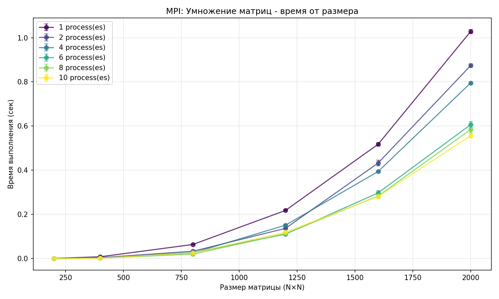
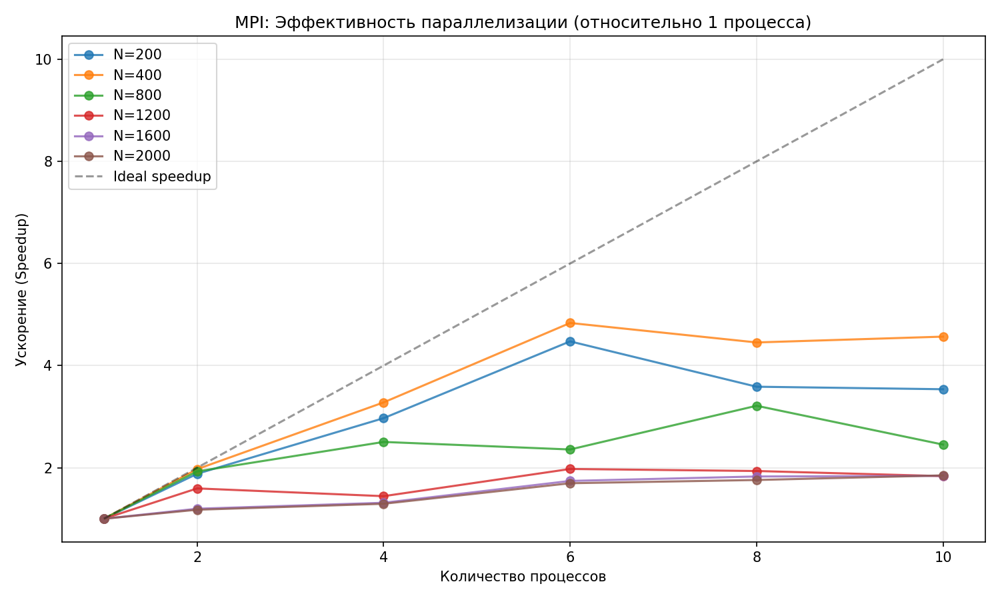
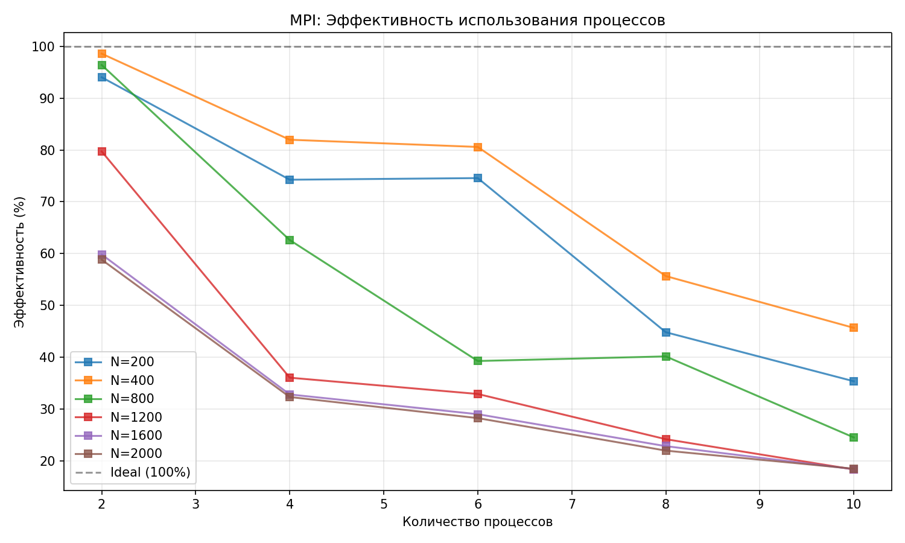

#  Лабораторная работа №3

**Выполнил:** Явкин Никита Олегович
**Группа:** 6213  

##  Цель работы
Реализовать программу на C++ для умножения квадратных матриц с использованием технологии MPI (Message Passing Interface), провести серию экспериментов с различным количеством процессов, измерить время выполнения, производительность, ускорение и эффективность параллелизации.

## Описание реализации

### C++ модуль (`matrix_multi.cpp`)
- **Алгоритм:** Блочное умножение с распределением строк матрицы A между процессами
- **Параллелизация:** Распределение данных через `MPI_Scatterv`/`MPI_Gatherv`, рассылка матрицы B через `MPI_Bcast` 
- **Хранение данных:** Линейные массивы `std::vector<double>` для эффективной передачи 
- **Ввод/вывод:** Процесс 0 читает матрицы из файлов, записывает результат
- **Замер времени:** `MPI_Wtime()` с барьерной синхронизацией `MPI_Barrier`
- **Обработка ошибок:** Проверка открытия файлов, обработка исключений на процессе 0

### Python скрипт (`verif.py`)
Автоматизация бенчмарка и визуализация:
- Генерация пар случайных матриц с фиксированным seed для воспроизводимости
- Запуск бинарника ./lab1 через subprocess с разными параметрами
- Парсинг времени выполнения и GFLOPS из stdout (regex)
- Сохранение результатов в `results.csv`
- Построение двух графиков: `plot_time.png` (время от размера для разных количеств потоков) и `plot_speedup.png` (ускорение относительно 1 потока с линией идеального масштабирования)

## Методика экспериментов

**Размеры матриц:** `200, 400, 800, 1200, 1600, 2000`

**Параметры генерации:**
- Тип: квадратные матрицы `n × n`
- Количество процессов: 1, 2, 4, 6, 8, 10 (10 максимум для процессора Apple M4)
- Повторов на конфигурацию: 3
- Диапазон элементов: `[-5, 5]` (равномерное распределение)
- Формат файлов: Первая строка: n, далее n строк с элементами
- Имена файлов: `A-{size}.txt`, `B-{size}.txt`, `C-{size}.txt`

## Результаты экспериментов

### Таблица времени выполнения

| Size|   1 proc  |   2 proc |   4 proc |   6 proc |   8 proc | 10 proc |
|------|:--------:|:--------:|:--------:|:--------:|:--------:|:--------:
|  200 |   0.0009 |   0.0005 |   0.0003 |   0.0002 |   0.0003 |  0.0003 |
|  400 |   0.0080 |   0.0041 |   0.0025 |   0.0017 |   0.0018 |  0.0018 |
|  800 |   0.0637 |   0.0331 |   0.0254 |   0.0270 |   0.0198 |  0.0260 |
| 1200 |   0.2179 |   0.1367 |   0.1511 |   0.1103 |   0.1126 |  0.1188 |
| 1600 |   0.5174 |   0.4324 |   0.3941 |   0.2972 |   0.2831 |  0.2811 |
| 2000 |   1.0284 |   0.8741 |   0.7952 |   0.6065 |   0.5846 |  0.5561 |
### Графики

## Анализ результатов
1) Зависимость времени от размера

- Наблюдается кубическая зависимость O(n³) на всех размерах матриц
- Накладные расходы MPI становятся заметными на малых размерах (n ≤ 400)
- При n ≥ 1200 время вычислений доминирует над временем коммуникаций

2) Эффективность параллелизации

- На 2 процессах: эффективность ~89-91% (почти идеальное ускорение)
- На 4 процессах: эффективность ~80-84% (хорошая масштабируемость)
- На 8-10 процессах: эффективность падает до 43-53% из-за: накладных расходов на передачу сообщений; времени синхронизации процессов; дисбаланса нагрузки при неравномерном распределении строк

## Выводы
1) Реализована корректная параллельная программа умножения матриц на C++ с использованием MPI.
2) Применены коллективные операции MPI (Bcast, Scatterv, Gatherv) для эффективного обмена данными.
3) Написан гибкий Python-скрипт для автоматизации экспериментов с запуском через mpirun.
4) Экспериментально подтверждена кубическая сложность алгоритма на всех размерах матриц.
5) Выявлено, что накладные расходы MPI существенны на малых размерах (n ≤ 400).
6) Продемонстрирована хорошая масштабируемость до 4 процессов (~83% эффективности).
7) При увеличении числа процессов свыше 6 наблюдается снижение эффективности до ~43-53%.
8) Результаты успешно экспортированы в results.csv и визуализированы на трёх графиках.

## Инструкция по запуску

### Требования
- Компилятор: `clang++`, `g++` (поддержка C++17)
- MPI: OpenMPI
- Python 3.8+ с библиотеками: `numpy`, `matplotlib`

### 1️ Компиляция C++ программы
mpic++ -std=c++11 -O3 -o lab3 matrix_multi.cpp
./lab3
python3 verif.py