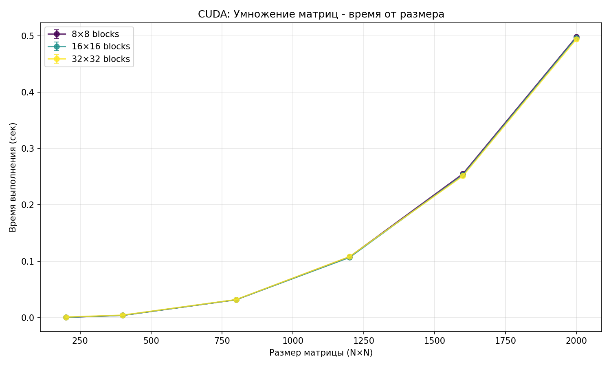
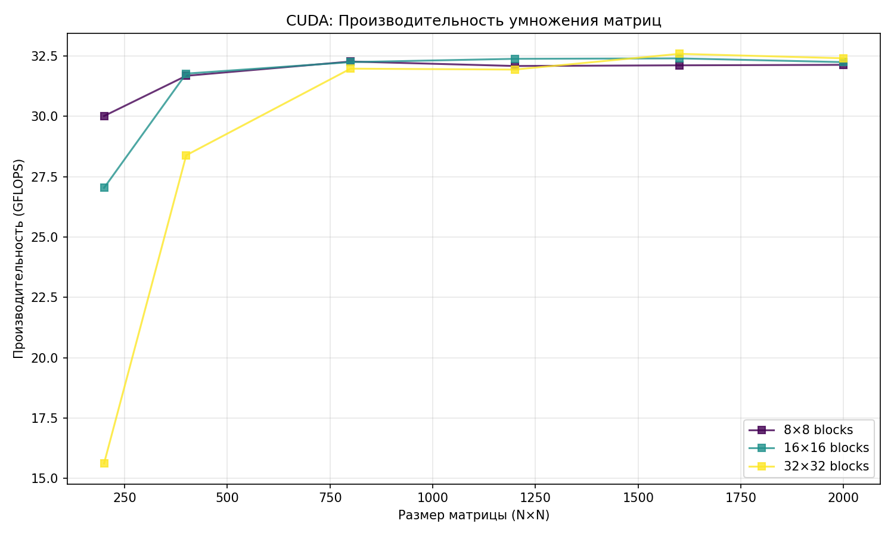

#  Лабораторная работа №4

**Выполнил:** Явкин Никита Олегович
**Группа:** 6213  

##  Цель работы
Реализовать программу на C++/CUDA для умножения квадратных матриц с использованием архитектуры NVIDIA GPU, автоматизировать запуск серии экспериментов с различными размерами матриц и конфигурациями сетки блоков, измерить время выполнения и производительность (GFLOPS).

## Описание реализации

### CUDA модуль (`matrix_cuda.cu`)
- **Ядра:** matrixMulKernel: каждый поток вычисляет один элемент результирующей матрицы C[i][j]
- **Конфигурация:** Динамический расчет gridDim и blockDim в зависимости от размера матрицы N и параметра block_size
- **Хранение данных:** Плоские массивы std::vector<double> на хосте, cudaMalloc для выделения видеопамяти
- **Ввод/вывод:** Чтение/запись текстовых файлов на CPU, передача данных через cudaMemcpy
- **Замер времени:** cudaEventCreate/Record/Synchronize/ElapsedTime (аппаратные таймеры GPU)
- **Обработка ошибок** Макрос/функция checkCudaError для проверки возвращаемых статусов CUDA API

### Python скрипт (`verif.py`)
Автоматизация бенчмарка и визуализация:
- Генерация пар случайных матриц с фиксированным seed
- Запуск lab4.exe через subprocess с перебором размеров и конфигураций блоков
- Парсинг времени и GFLOPS из stdout
- Сохранение результатов в `results.csv`
- Построение двух графиков: `plot_time.png` (время от размера) и `plot_perfomance.png` (производительность умножения матриц)

## Методика экспериментов

**Размеры матриц:** `200, 400, 800, 1200, 1600, 2000`
**Размеры блоков** `8×8, 16×16, 32×32`
**Аппаратная платформа** NVIDIA GeForce RTX 3070 Laptop GPU (Compute 8.6, 8 ГБ VRAM, 40 SM)

## Результаты экспериментов

### Таблица времени выполнения

|  Size |   8 block  |  16 block  |  32 block  |
|-------|:----------:|:----------:|:----------:|
|   200 |   0.000533 |   0.000592 |   0.001024 |
|   400 |   0.004041 |   0.004029 |   0.004510 |
|   800 |   0.031736 |   0.031760 |   0.032029 |
|  1200 |   0.107727 |   0.106738 |   0.108227 |
|  1600 |   0.255131 |   0.252865 |   0.251407 |
|  2000 |   0.497991 |   0.496266 |   0.493811 |

### Графики

## Анализ результатов
1) Влияние размера блока (Block Size)

- 8×8 и 16×16: Показывают наилучшие результаты на всем диапазоне размеров. Время выполнения практически идентично.
- 32×32: На малых матрицах (200, 400) работает медленнее (почти в 2 раза на N=200).
Причина: При большом размере блока и малой матрице количество блоков в сетке (gridDim) становится слишком маленьким. Это приводит к неполной загрузке потоковых мультипроцессоров (SM) видеокарты.
На больших матрицах (1600, 2000) разница исчезает, так как блоков становится достаточно для полной загрузки GPU.

2) Зависимость времени от размера
- График времени имеет кубический характер, что соответствует сложности алгоритма
- Время растет пропорционально увеличению объема вычислений.

3) Производительность (GFLOPS)
На малых матрицах (N=200) виден сильный разброс производительности в зависимости от размера блока.
Начиная с N=800, кривые сходятся, и производительность выходит на "плато" около 32 GFLOPS.
Примечание: RTX 3070 имеет низкую производительность в вычислениях двойной точности (double), поэтому значение 32 GFLOPS является ожидаемым пределом для данной карты в этом режиме.

## Выводы
- Реализована программа умножения матриц на CUDA.
- Экспериментально подтверждено, что для данной задачи оптимальными являются размеры блоков 8×8 и 16×16.
- Использование слишком больших блоков (32×32) неэффективно на малых размерах матриц из-за снижения параллелизма на уровне блоков.
- Достигнута стабильная производительность ~32 GFLOPS на больших матрицах.
- Результаты успешно экспортированы в `results.csv` и визуализированы в `plot_time.png`и `plot_perfomance.png`.

## Инструкция по запуску

### Требования
- ОС: Windows 10/11
- GPU: NVIDIA с поддержкой CUDA
- ПО: CUDA Toolkit 11.8+, Visual Studio Build Tools (MSVC)
- Python 3.8+ с библиотеками: `numpy`, `matplotlib`.

### Компиляция
nvcc -arch=sm_86 -o lab4.exe matrix_cuda.cu
python verif.py